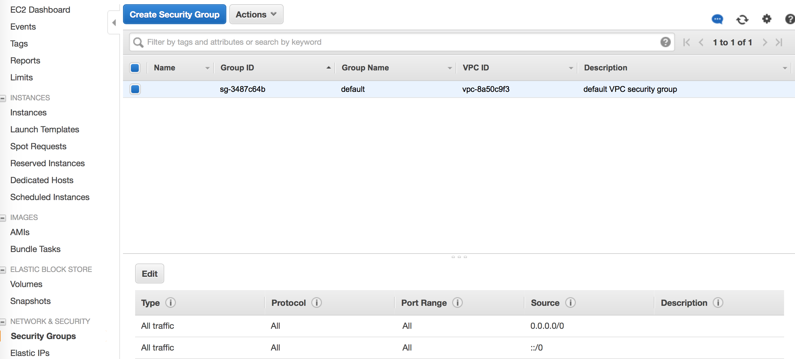

* Set up your billing account by visiting [Billing Account](https://console.aws.amazon.com/billing/). 

* Create an Identity and Access Management (IAM) user by visiting [IAM Add User](https://console.aws.amazon.com/iam/home?nc2=h_m_sc#/users). 
1. Enter a username for yourself and click next
2. For permissions, either create a group and add the user to a group or choose 'attaching existing ploicies directly'. Choose **AdministratorAccess** or **AmazonEC2FullAccess** or any other policy that you feel is approperiate for your use, then click next.
3. Verify information and click *Create user*. You should now be able to see your **Access key ID** and **Secret access key**. You will need these keys to setup your cluster. You should save them somewhere to retrive later. 
4.  Make sure you check your Security Group settings to allow all traffic for SSH connection. You security group setting should look like the image below:  
        
5.  If you do GPU computing, you will need to request a number of p2 and p3 (e.g., p3.16xlarge) instances. You can request limit increase by visiting [EC2 Limits](https://us-west-2.console.aws.amazon.com/ec2/v2/home?region=us-west-2#Limits:) or [EC2 Request](http://aws.amazon.com/contact-us/ec2-request)
    Visit [Amazon Instance Types](https://aws.amazon.com/ec2/instance-types/) to see what fits your needs.

[Continue to Step 2: Creating Your Cluster](monajemi-murri-model/#part-2-create-your-cluster-using-elasticluster)
