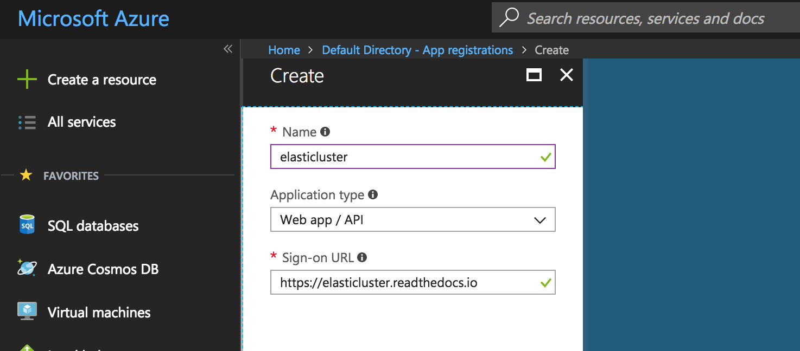
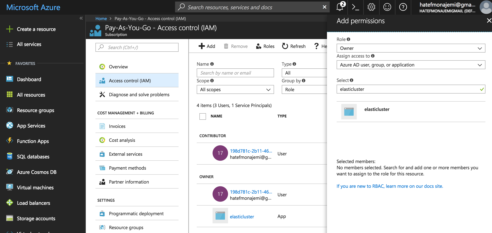

* Create a **subscription** by visiting [subscription page](https://account.azure.com/signup?showCatalog=True)
    1. You may choose Pay-As-You-Go    
    1. Visit `Home > Subscriptions` and take a note of your subscription ID (You will need this ID for elasticluster's config ).
* Create an application as described in [Azure Register Application](https://docs.microsoft.com/en-us/azure/azure-resource-manager/resource-group-create-service-principal-portal#get-application-id-and-authentication-key) to get an **application ID**, a **secrete key**, and a **tennant ID** for authetication purposes.

    1. Register an application that can access compute, storage and network resources.
         
    2. Save your **application ID** somewhere locally (e.g., in elasticluster's config) 
    3. Create a secret key by going to `> Settings > Keys` of your application. Save the secret key of your application somewhere safe (e.g., in elasticluster's config). You will not be able to retrive this value at a later time.
    4. Get you **tennant ID** from `Azure Active Directory > Properties > Directory ID`. Save it somewhere (e.g., in elasticluster's config)
    5. Go to your Subscription's Access Control (IAM) section and add the **Owner** role to your application (eg. elasticluster) as shown below.
            

    > Please note that you application need to have an `Owner` role in your subscription in order to get `write` access. You should think of your application as a user with certain roles. If you don't do this step, you will get error while building your cluster. 

* If you do GPU computing, you will need to request a number of Standard_NC, Standard_NCv2, Standard_NCv3, or Standard_ND (e.g., Standard_ND12 give you 2 P40-GPUs with 12 vCPUs) instances (See [GPU instances](https://docs.microsoft.com/en-us/azure/virtual-machines/windows/sizes-gpu)). You can request quota increase by visiting [Azure Quota Page](http://aka.ms/corequotaincrease). You need to *create a support request* for the number of allowable cores for particular GPU instances by going to `Help + support` or your Azure portal (question mark on the right side of the top navigation bar). The default number of vCPUs is 20. Visit [Azure Instance Types and Pricing](https://azure.microsoft.com/en-us/pricing/details/virtual-machines/linux/) to see what fits your needs.

* To see a list of VM images that you can use, visit [Azure Image List](https://gist.github.com/sjkp/60085891dd03b8cfb7c4)

[Continue to Step 2: Creating Your Cluster](monajemi-murri-model/#part-2-create-your-cluster-using-elasticluster)
