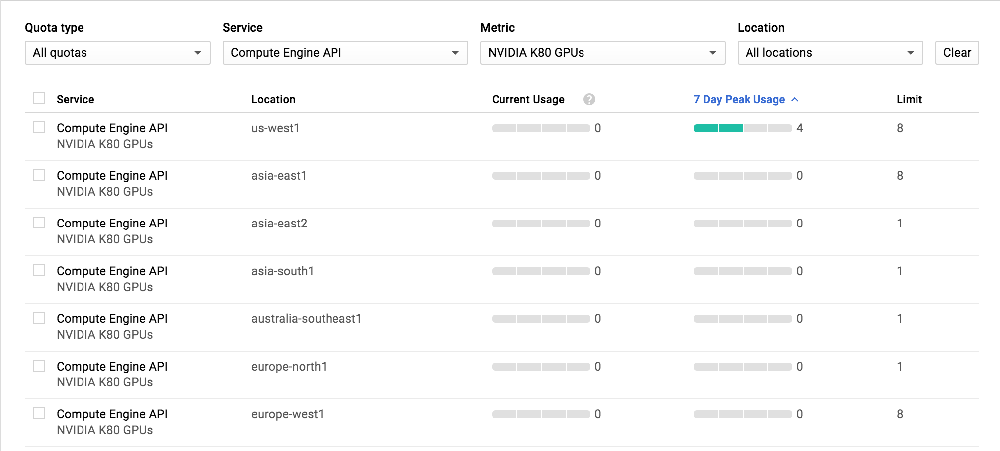
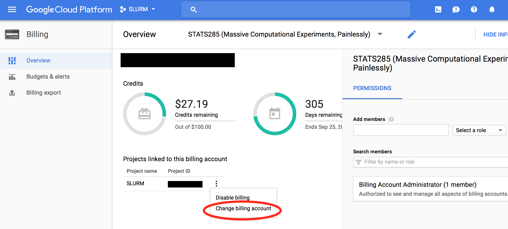

* Set up your billing account by visiting [Billing Account](https://console.cloud.google.com/billing). As a first time user, you will get $300 free credit from Google Cloud that allows only very limited CPU computations.
*  Create a Google Project by Visiting [Manage resources](https://console.cloud.google.com/cloud-resource-manager?_ga=2.13784503.-1419916998.1496658742) (This may take some time, be patient). You may find your project ID here which will be needed later.    
* Visit [Google Credential page](https://console.cloud.google.com/project/_/apiui/credential), and creat your credentials `client_id`, `client_secret`
1. select **Create credentials**
2. select **OAuth client ID**
3. select  **Configure conset screen**   
            * Choose your **project name** and **save**
4. If prompted for **Application Type** choose **Other**    
            * choose a name for your application (e.g., `elasticluster`)
5. select **Create** 
> Once successful, the interface will show your `client_id`  and `client_secret`.
> These values appear at the Credentials tab and you may retrive them at a later time by clicking on your application name (step 4).
6. **Enable** Google Compute for your project by visiting  [Enable Compute Engine](https://console.developers.google.com/apis/api/compute.googleapis.com)
7. **Enable** Billing for your project by visiting [Enable Billing](https://console.developers.google.com/projectselector/billing/enable?redirect=https:%2F%2Fdevelopers.google.com%2Fplaces%2Fweb-service%2Fusage%3FdialogOnLoad%3Dbilling-enabled)
<!-- 8. Go to [Metadata](https://console.cloud.google.com/compute/metadata/sshKeys) and add your `~/.ssh/id_rsa.pub` contents to SSH Keys on Google. -->
> If you fail to satisfy steps 6 and 7 above, your instances will not start and you get errors. Make sure you enable those.
9. If you do GPU computing, visit [quota page](https://console.cloud.google.com/projectselector/iam-admin/quotas), choose your project, then **EDIT QUOTAS** and request 8 NVIDIA K80 GPUs at `us-west1` zone. You will need this to use GPU accelerators. The default GPU quota is zero. For “justification” write a good reason such as “ambitious data science”. For ease of selection choose your only favorite GPU type in the metric column. 
      

 If you are unable to choose the GPU service, then the billing account associated with your project is incorrect. In this case, go to [Billing Page](https://console.cloud.google.com/billing) and change the billing account to the correct one as shown in the picture below.   
      **Please note that if you request more than 8 GPUs, google requires a $1500 advanced deposit**. So, if you don't plan on using many GPUs, limit your request to 8 or less.' 

For more info on obtaining your Google credentials, you may visit [googlegenomics](http://googlegenomics.readthedocs.io/en/latest/use_cases/setup_gridengine_cluster_on_compute_engine/)     

[Continue to Step 2: Creating Your Cluster](elasticluster-clusterjob-model#part-2-create-your-cluster-using-elasticluster)
